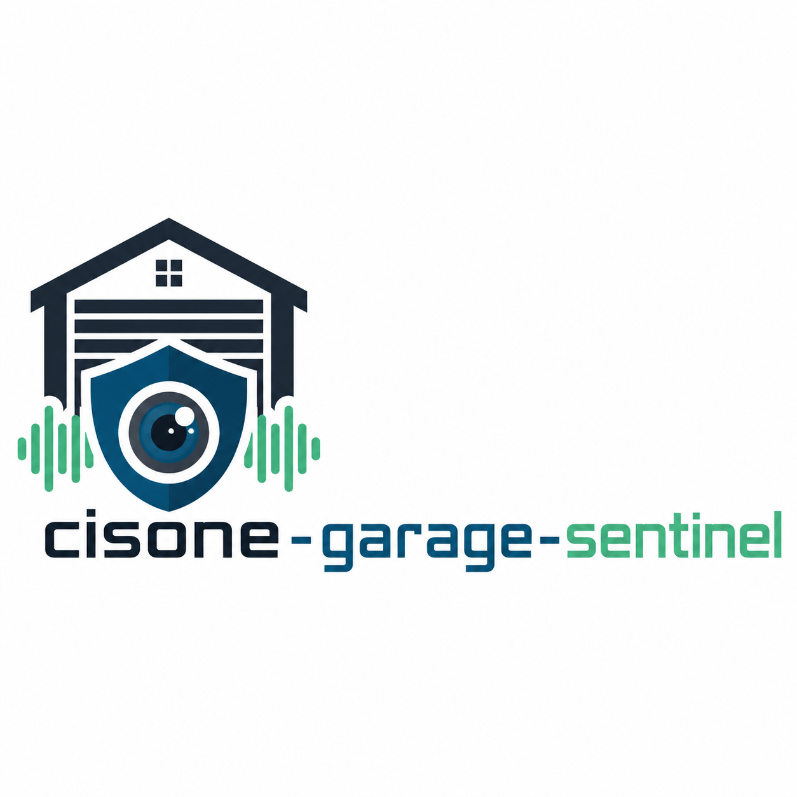

# cisone-garage-sentinel


## Version 0.1.0 - August 23 2026

`cisone-garage-sentinel` is a dedicated garage security node for the **cisOne** system, built around an **ESP32-S3-WROOM N16R8 camera module** and an **INMP441 I2S microphone**.

The project is being rebuilt from the ground up after an earlier ESP32-CAM prototype proved useful for experimentation but never produced reliably audible microphone recordings. Development will proceed in tightly controlled phases, with each subsystem validated independently before integration.

## Project Goals

The completed device is intended to provide:

- reliable garage video monitoring;
- continuous INMP441 audio acquisition;
- recognisable recorded audio;
- acoustic event detection;
- still-image and video capture;
- low-light operation;
- concurrent camera and microphone operation;
- local device health monitoring;
- secure integration with cisOne;
- future motion and person detection;
- future event-linked audio and image recording.

The project will not progress to higher-level security functions until the lower-level hardware and audio milestones have been proven.

## Hardware

Current target hardware:

- ESP32-S3-WROOM N16R8
  - 16 MB flash
  - 8 MB PSRAM
- Camera module
- INMP441 I2S MEMS microphone

Additional hardware may be added only after the camera and microphone subsystems are independently validated.

## Development Environment

- Visual Studio Code
- PlatformIO
- Arduino framework
- C/C++
- PowerShell 7
- Git
- cisOne backend integration in later phases

Repository location:

```text
C:\Users\mike_\Documents\coding\smartHome\cisone-garage-sentinel
```

## Project Structure

```text
cisone-garage-sentinel/
├── platformio.ini
├── .gitignore
├── README.md
│
├── include/
│   ├── config.h
│   └── env.h
│
├── src/
│   └── main.cpp
│
├── lib/
├── test/
└── docs/
```

### Configuration Files

`config.h`

Contains non-secret project configuration, feature settings, hardware-independent constants, firmware version information, and compile-time defaults.

`env.h`

Contains deployment-specific and private configuration such as:

- Wi-Fi credentials;
- static IP configuration;
- cisOne server address;
- API credentials;
- OTA credentials;
- device-specific network settings.

`env.h` must not be committed to Git.

A sanitised template may later be added as:

```text
include/env.example.h
```

## Development Principles

### 1. Validate one subsystem at a time

The previous prototype combined camera, microphone, HTTP, cisOne uploads, triggering, streaming and OTA before the microphone had been fully proven.

This project will avoid that approach.

Each phase has a defined acceptance milestone. Development only proceeds when that milestone passes.

### 2. Audible microphone recording is mandatory

Changing sample values or detecting noise is not sufficient proof that the INMP441 is working correctly.

The microphone milestone is:

> Recorded PCM/WAV audio must contain clearly recognisable speech, claps and other test sounds when played back on the development computer.

### 3. Camera and microphone must operate concurrently

Live video must not disable:

- microphone acquisition;
- acoustic event detection;
- device health reporting;
- OTA;
- cisOne communication.

The final firmware architecture will separate time-critical audio acquisition from camera streaming and network activity.

### 4. Security functions must fail predictably

The device must expose meaningful health state for:

- camera;
- microphone;
- Wi-Fi;
- PSRAM;
- cisOne connectivity;
- event upload status.

A powered device must not automatically be considered a healthy security node.

# Phase Milestones

## Phase 1 — ESP32-S3 Hardware Baseline

### Objectives

- establish the PlatformIO project;
- verify the ESP32-S3 toolchain;
- compile and upload firmware;
- confirm serial communication;
- identify the chip correctly;
- confirm CPU configuration;
- confirm 16 MB flash;
- confirm 8 MB PSRAM;
- perform a PSRAM allocation/write/read test;
- establish a stable heartbeat.

### Acceptance Criteria

```text
PlatformIO build        PASS
Firmware upload         PASS
Serial monitor          PASS
Chip                    ESP32-S3
Flash                   16 MB
PSRAM                   8 MB
PSRAM allocation test   PASS
Stable heartbeat        PASS
```

No camera or microphone functionality is required for Phase 1.

## Phase 2 — INMP441 Microphone Proof

### Objectives

- connect the INMP441 only;
- configure ESP32-S3 I2S;
- verify the correct channel and pin configuration;
- inspect raw sample values;
- determine sample alignment;
- measure minimum, maximum, peak and RMS levels;
- capture PCM audio;
- create a valid WAV recording;
- transfer the recording to the development computer;
- listen to the recording.

### Acceptance Criteria

The recorded audio must contain clearly recognisable:

- spoken words;
- hand claps;
- nearby environmental sounds.

The project does **not** proceed to Phase 3 until this passes.

## Phase 3 — Stable Audio Subsystem

### Objectives

- establish reliable continuous I2S acquisition;
- implement bounded read timeouts;
- add error counters and recovery;
- calculate real RMS;
- calculate calibrated dBFS;
- establish an audio ring buffer;
- support repeatable WAV capture;
- test long-duration microphone operation;
- monitor heap and PSRAM use.

### Acceptance Criteria

- continuous audio capture remains stable;
- repeated recordings remain intelligible;
- no I2S lockups;
- no progressive memory loss;
- audio health can be reported accurately.

## Phase 4 — Camera Proof

### Objectives

- identify the exact camera sensor and pin mapping;
- initialise the camera independently;
- capture JPEG still images;
- establish stable image quality;
- verify PSRAM framebuffer operation;
- establish live video streaming;
- assess low-light performance.

### Acceptance Criteria

- repeatable still capture;
- stable live stream;
- no camera initialization failures;
- no unexplained PSRAM or heap degradation.

## Phase 5 — Concurrent Camera and Microphone

### Objectives

- run continuous microphone acquisition while the camera is active;
- separate critical work using FreeRTOS tasks where appropriate;
- ensure live streaming does not interrupt audio acquisition;
- ensure image capture does not interrupt audio acquisition;
- monitor CPU, heap and PSRAM usage;
- establish safe task priorities and queues.

### Acceptance Criteria

While live video is being streamed:

- microphone sampling continues;
- audio remains intelligible;
- HTTP control remains responsive;
- health reporting continues;
- no watchdog resets occur.

## Phase 6 — Security Event Detection

### Objectives

- establish startup ambient calibration;
- calculate acoustic baseline;
- detect significant sound events;
- add debounce and cooldown logic;
- retain pre-trigger audio using the ring buffer;
- capture post-trigger audio;
- associate sound events with camera images;
- investigate motion detection;
- investigate person detection.

### Acceptance Criteria

A detected event produces a coherent local event record containing appropriate metadata and media without disrupting ongoing monitoring.

## Phase 7 — cisOne Integration

### Objectives

- assign the device identity `esp32cam-garage`;
- implement Wi-Fi and unattended reconnection;
- implement authenticated cisOne communication;
- publish device health;
- upload security events;
- upload image attachments;
- upload audio attachments;
- correlate image and audio under a common event ID;
- integrate with the cisOne garage security zone;
- support OTA update securely.

### Acceptance Criteria

cisOne can determine:

- whether the device is online;
- whether the camera is healthy;
- whether the microphone is healthy;
- when the last security event occurred;
- whether the most recent upload succeeded;
- which image and audio recordings belong to an event.

## Future Phases

Possible later work includes:

- local person detection;
- motion classification;
- event scoring;
- live audio listening;
- two-way audio;
- infrared illumination;
- secure browser controls;
- event retention rules;
- local buffering during cisOne outages;
- watchdog and self-recovery mechanisms.

These are deliberately outside the initial hardware validation phases.

# Versioning

The project uses semantic-style firmware versions with an optional development phase suffix.

Examples:

```text
0.1.0-phase1
0.2.0-phase2
0.3.0-phase3
1.0.0
```

Major version `1.0.0` should represent the first stable garage security-node release integrated with cisOne.

# Worklog

| Date | Version | Commit name | Milestone / Notes |
|---|---|---|---|
| 2026-08-23 | `0.1.0-phase1` | `Initialize ESP32-S3 hardware baseline` | Created the new `cisone-garage-sentinel` PlatformIO project. Defined the ground-up development strategy, project structure, N16R8 hardware-validation phase, and mandatory audible-INMP441 milestone. |

Add one row for each meaningful tested commit rather than every minor edit.

Suggested commit naming style:

```text
Initialize ESP32-S3 hardware baseline
Verify N16R8 PSRAM
Add INMP441 I2S acquisition
Capture first intelligible WAV
Stabilize continuous audio capture
Add camera still capture
Add concurrent audio and video tasks
Add acoustic event detection
Integrate cisOne event upload
```

# Current Status

**Current phase:** Phase 1 — ESP32-S3 Hardware Baseline

Current immediate goal:

> Build, upload and run the minimal ESP32-S3 firmware and confirm the module reports 16 MB flash, 8 MB PSRAM and stable operation before connecting or programming the INMP441.
